# BÁO CÁO LÝ THUYẾT: FEATURE EXTRACTION (TRÍCH XUẤT ĐẶC TRƯNG)
**Dự án:** Tách nguồn âm thanh và Nhận dạng tiếng nói  
**Tác giả:** [Họ tên sinh viên]  
**Ngày:** 26/12/2025

---

## TỔNG QUAN

**Feature Extraction** (Trích xuất đặc trưng) là bước cực kỳ quan trọng trong xử lý tín hiệu âm thanh, đóng vai trò như cầu nối giữa tín hiệu âm thanh thô (raw audio) và các thuật toán học máy/xử lý bậc cao. Thay vì làm việc trực tiếp với hàng nghìn mẫu âm thanh, ta chuyển đổi chúng thành các **vector đặc trưng súc tích** mang thông tin quan trọng nhất.

### Tại sao cần Feature Extraction?

1. **Giảm chiều dữ liệu**: Một file âm thanh 1 giây với tần số lấy mẫu 16kHz có 16,000 mẫu → Sau trích xuất chỉ còn vài chục đến vài trăm giá trị đặc trưng
2. **Loại bỏ nhiễu và thông tin dư thừa**: Giữ lại những thông tin quan trọng cho nhận dạng
3. **Mô phỏng hệ thống thính giác con người**: Các đặc trưng như MFCC được thiết kế dựa trên cách tai người cảm nhận âm thanh

### Ba phương pháp chính trong dự án

Trong dự án này, chúng ta triển khai 3 phương pháp trích xuất đặc trưng:

| Phương pháp | File triển khai | Ứng dụng chính |
|-------------|----------------|----------------|
| **STFT** | `src/features/stft.py` | Phân tích thời gian-tần số, tách kênh đơn |
| **MFCC** | `src/features/mfcc.py` | Nhận dạng tiếng nói (DTW) |
| **LPC** | `src/features/lpc.py` | Phân tích formant, mô hình hóa đường phát âm |

### File mẫu phân tích

Trong báo cáo này, chúng ta sẽ phân tích chi tiết file **`digit_0.wav`** (số "0" đọc bằng tiếng Việt) qua từng bước của mỗi phương pháp.

**Thông tin file:**
- **Tần số lấy mẫu:** 16,000 Hz (16 kHz)
- **Độ phân giải:** 16-bit
- **Thời lượng:** ~0.79 giây
- **Số mẫu:** 12,672 mẫu

---

## PHẦN I: STFT (SHORT-TIME FOURIER TRANSFORM)

### 1.1. Giới thiệu

**STFT** (Biến đổi Fourier thời gian ngắn) là nền tảng cho việc quan sát âm thanh trong cả miền **thời gian** và **tần số** đồng thời. Không giống như FFT thông thường áp dụng cho toàn bộ tín hiệu, STFT chia tín hiệu thành các khung (frames) nhỏ và thực hiện FFT trên từng khung.

### 1.2. Tín hiệu thô (Raw Audio)

File `.wav` lưu trữ âm thanh dưới dạng một chuỗi các số nguyên đại diện cho biên độ của sóng âm tại từng thời điểm lấy mẫu.

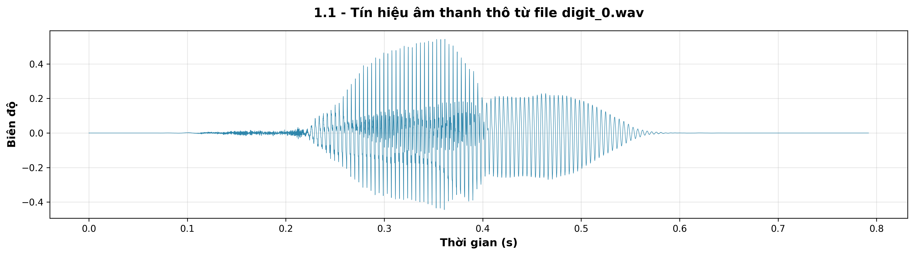

**Quan sát:**
- Trục ngang: Thời gian (s) - từ 0 đến ~0.79s
- Trục dọc: Biên độ chuẩn hóa (từ -1 đến 1)
- Các dao động thể hiện sóng âm thanh

**Định luật Nyquist:** Với tần số lấy mẫu f_s = 16,000 Hz, ta có thể khôi phục chính xác các tần số lên đến f_max = f_s/2 = 8,000 Hz (đủ bao phủm các formant quan trọng của giọng người).

### 1.3. Framing & Windowing (Chia khung và Nhân hàm cửa sổ)

Vì tín hiệu âm thanh liên tục thay đổi, ta không thể áp dụng FFT trực tiếp cho toàn bộ. Giải pháp:

**Bước 1: Framing (Chia khung)**
- Chia tín hiệu thành các khung nhỏ (thường 20-40ms)
- Các khung **chồng lấp** (overlap) để đảm bảo tính liên tục

Trong dự án:
- **Frame length** = 512 mẫu ≈ 32ms (tại 16kHz)
- **Hop length** = 256 mẫu ≈ 16ms → Overlap 50%

**Bước 2: Windowing (Nhân hàm cửa sổ)**

Khi cắt một khung tín hiệu, ta tạo ra các "biên cạnh" đột ngột → gây ra hiện tượng **spectral leakage** (rò rỉ phổ) trong FFT.

**Giải pháp:** Nhân mỗi khung với một hàm cửa sổ để làm mượt hai đầu.

**Hàm cửa sổ Hamming:**

$$
w[n] = 0.54 - 0.46 \cos\left(\frac{2\pi n}{N-1}\right), \quad n = 0, 1, ..., N-1
$$

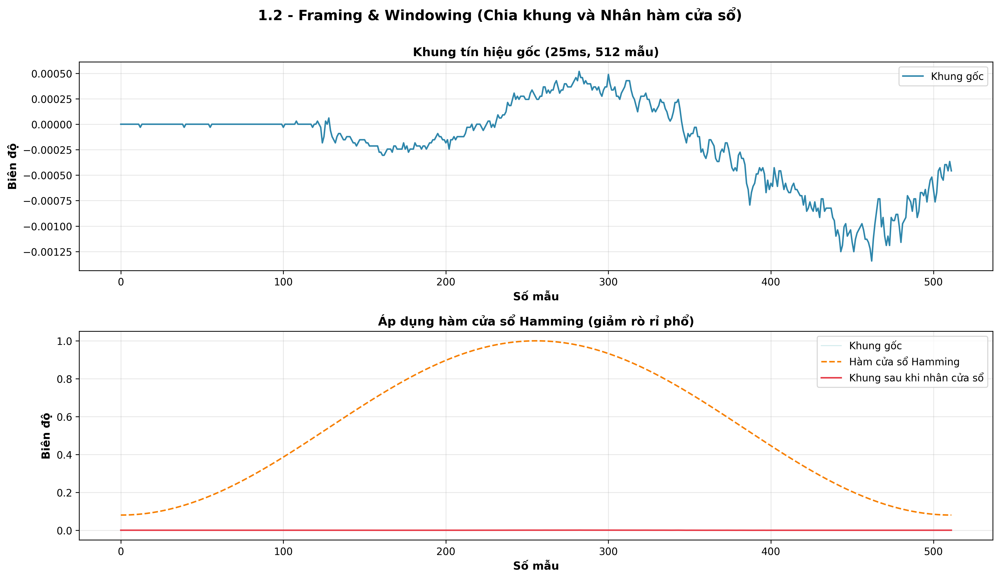

**Quan sát:**
- **Trên:** Khung gốc có biên độ đồng đều
- **Dưới:** 
  - Đường cam: Hàm Hamming (cao ở giữa, giảm dần ở hai đầu)
  - Đường đỏ: Kết quả sau khi nhân (khung được "làm mượt" ở hai đầu)

### 1.4. FFT và Spectrogram

Sau khi đã có các khung đã qua windowing, ta áp dụng **FFT (Fast Fourier Transform)** lên từng khung để chuyển từ miền thời gian sang miền tần số.

**Công thức STFT:**

$$
X[m, k] = \sum_{n=0}^{N-1} x[m \cdot H + n] \cdot w[n] \cdot e^{-j2\pi kn/N}
$$

Trong đó:
- $m$: Chỉ số khung (frame index)
- $k$: Chỉ số tần số (frequency bin)
- $H$: Hop length
- $w[n]$: Hàm cửa sổ
- $N$: FFT size

**Kết quả:** Ma trận STFT phức có kích thước $(N/2+1) \times M$ với:
- $N/2+1 = 257$ tần số bins (do tính đối xứng của FFT cho tín hiệu thực)
- $M$: Số khung

**Spectrogram = |STFT|²** (bình phương độ lớn)

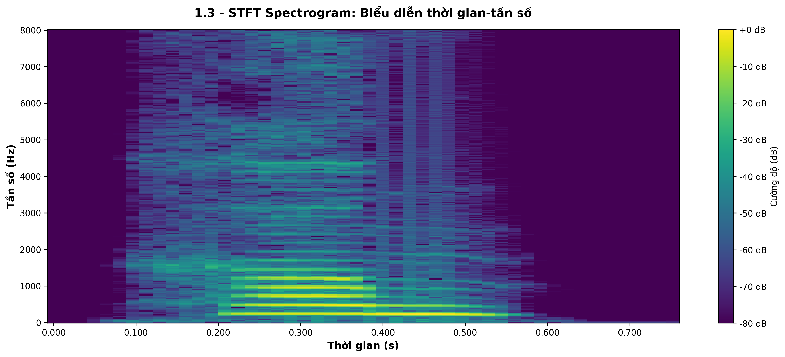

**Quan sát:**
- **Trục X:** Thời gian - cho thấy sự biến đổi qua thời gian
- **Trục Y:** Tần số (Hz) - từ 0 đến 8000 Hz
- **Màu sắc:** Cường độ (dB) - vàng là mạnh, xanh tím là yếu
- Các vùng sáng thể hiện các **formant** (đỉnh cộng hưởng) của nguyên âm trong từ "không"

### 1.5. Ứng dụng trong dự án

**STFT** được sử dụng trong:
1. **Single-channel separation** (`src/single_channel/sparse_separation.py`): Tách nguồn âm thanh bằng NMF trên Spectrogram
2. **Visualization** (`src/visualization/plots.py`): Hiển thị phổ tần số
3. **Cơ sở cho MFCC**: MFCC sử dụng power spectrum từ STFT

---

## PHẦN II: MFCC (MEL-FREQUENCY CEPSTRAL COEFFICIENTS)

### 2.1. Giới thiệu

**MFCC** là bộ đặc trưng phổ biến nhất trong nhận dạng tiếng nói vì nó mô phỏng rất sát cách tai người cảm nhận âm thanh. Quy trình MFCC gồm 6 bước chính:


### 2.2. Bước 1: Pre-emphasis (Tiền nhấn)

**Vấn đề:** Âm thanh giọng nói tự nhiên có xu hướng bị giảm năng lượng ở các tần số cao (khoảng -6 dB/octave).

**Giải pháp:** Áp dụng bộ lọc thông cao (high-pass filter) để **cân bằng lại phổ**.

**Công thức:**

$$
y[n] = x[n] - \alpha \cdot x[n-1]
$$

Trong đó $\alpha$ thường chọn từ 0.95 đến 0.97. Trong dự án này, $\alpha = 0.97$.

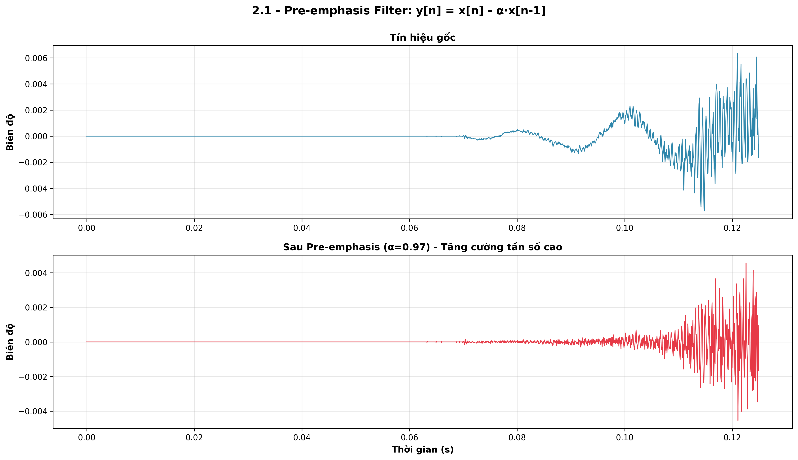

**Quan sát:**
- **Trên:** Tín hiệu gốc có các dao động tương đối "mượt"
- **Dưới:** Sau pre-emphasis, các dao động "sắc nét" hơn → Tần số cao được tăng cường

**Tác dụng:**
- Giúp các đặc trưng ở tần số cao (như phụ âm xát "s", "sh") không bị lấn át bởi các tần số thấp
- Cải thiện SNR (tỷ lệ tín hiệu/nhiễu) ở dải tần cao

### 2.3. Bước 2: Framing, Windowing và FFT

Tương tự như STFT (đã trình bày ở Phần I):
1. Chia tín hiệu thành các khung 25ms
2. Nhân với hàm cửa sổ Hamming
3. Áp dụng FFT để thu được phổ phức

### 2.4. Bước 3: Power Spectrum (Phổ năng lượng)

Từ FFT phức, ta tính **Power Spectrum**:

$$
P[k] = |X[k]|^2 = \text{Re}^2(X[k]) + \text{Im}^2(X[k])
$$

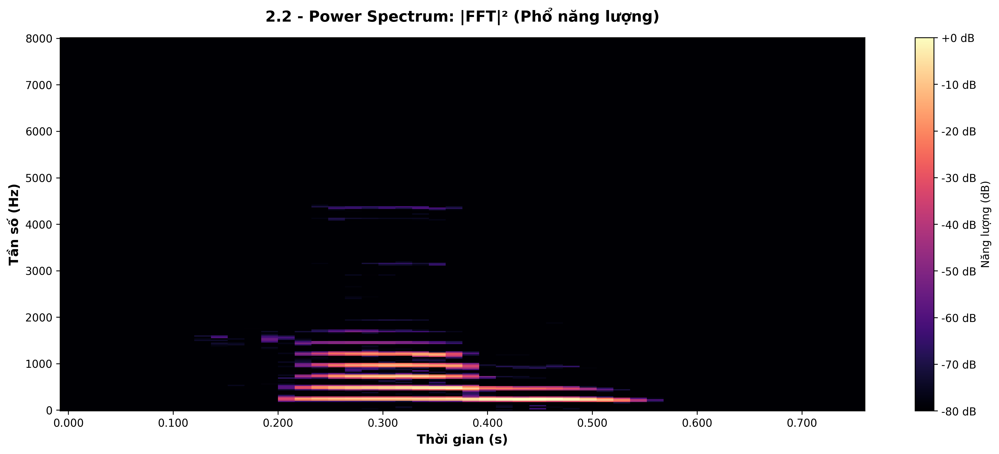

**Quan sát:**
- Power spectrum cho thấy phân bố năng lượng theo tần số
- Các vùng sáng (năng lượng cao) tương ứng với các formant của giọng nói

### 2.5. Bước 4: Mel Filterbank (Bộ lọc thang Mel)

Đây là **bước quan trọng nhất** của MFCC, giúp mô phỏng hệ thống thính giác con người.

#### 2.5.1. Thang Mel là gì?

**Vấn đề:** Tai người nghe tần số **không tuyến tính**:
- Ở tần số thấp (< 1000 Hz): Tai rất nhạy, phân biệt được sự khác biệt nhỏ
- Ở tần số cao (> 3000 Hz): Tai kém nhạy hơn

**Thang Mel** được thiết kế để mô phỏng đặc tính này:

$$
\text{Mel}(f) = 2595 \cdot \log_{10}\left(1 + \frac{f}{700}\right)
$$

Công thức nghịch đảo:

$$
f = 700 \cdot \left(10^{\text{Mel}/2595} - 1\right)
$$


**Quan sát:**
- **Trái:** Thang Hz tuyến tính
- **Phải:** Thang Mel phi tuyến (tăng nhanh ở tần số thấp, chậm ở tần số cao)

#### 2.5.2. Bộ lọc Mel (Mel Filterbank)

Ta tạo một tập hợp các bộ lọc hình **tam giác** phân bố đều trên thang Mel (thường 26-40 bộ lọc):

**Thuật toán:**
1. Chuyển đổi $f_{\min}$ (thường 0 Hz) và $f_{\max}$ (thường 8000 Hz) sang thang Mel
2. Chia đều thang Mel thành $M + 2$ điểm ($M$ = số bộ lọc)
3. Chuyển các điểm Mel ngược lại sang Hz
4. Tạo các bộ lọc tam giác: mỗi bộ lọc có đỉnh tại một điểm và kéo dài đến hai điểm lân cận

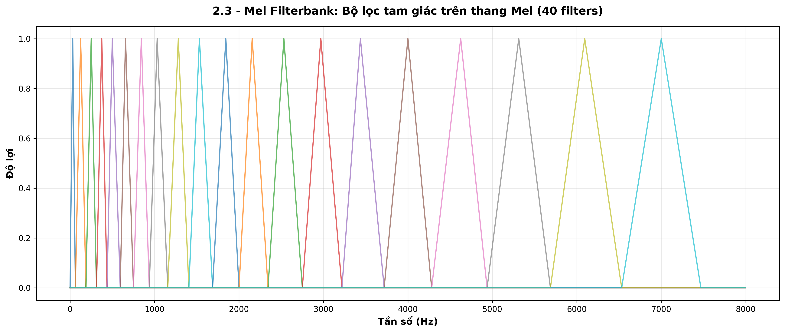

**Quan sát:**
- Các bộ lọc **dày đặc** ở tần số thấp (cao độ phân giải)
- Các bộ lọc **thưa thớt** ở tần số cao (thấp độ phân giải)
- Mỗi bộ lọc chồng lấp với bộ lọc kế cận

**Áp dụng bộ lọc:**

$$
S[m] = \sum_{k=0}^{N/2} P[k] \cdot H_m[k]
$$

Trong đó:
- $S[m]$: Năng lượng tại bộ lọc Mel thứ $m$
- $P[k]$: Power spectrum
- $H_m[k]$: Bộ lọc Mel thứ $m$

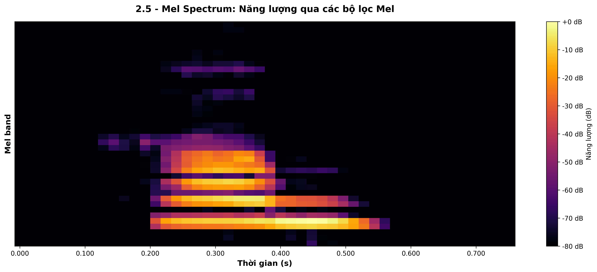

**Kết quả:** Từ 257 frequency bins → Thu gọn thành 40 Mel bands

### 2.6. Bước 5: Logarithm (Lấy Log)

Tai người cảm nhận âm lượng theo **thang logarit** (decibel). Ta áp dụng log lên năng lượng Mel:

$$
\log S[m] = \log\left(\sum_{k} P[k] \cdot H_m[k]\right)
$$

(Thêm một hằng số nhỏ $\epsilon \approx 10^{-10}$ để tránh log(0))

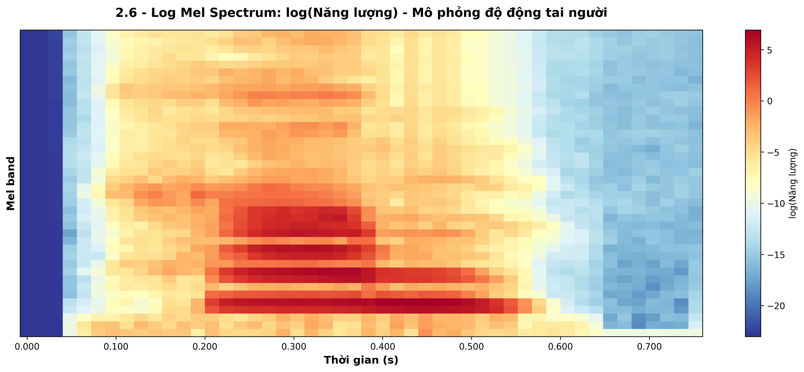

**Tác dụng:**
- Giảm độ nhạy cảm với sự thay đổi về âm lượng
- Mô phỏng độ động (dynamic range) của tai người

### 2.7. Bước 6: DCT (Discrete Cosine Transform)

**Vấn đề:** Các bộ lọc Mel chồng lấp → Các giá trị log Mel energy có **tương quan cao** với nhau.

**Giải pháp:** Áp dụng **DCT** để "phi tương quan" (decorrelate) và nén thông tin.

**Công thức DCT-II:**

$$
c[n] = \sum_{m=0}^{M-1} \log S[m] \cdot \cos\left[\frac{\pi n (m + 0.5)}{M}\right]
$$

Trong đó:
- $n = 0, 1, ..., N_{\text{MFCC}}-1$ (thường $N_{\text{MFCC}} = 13$)
- $M$: Số bộ lọc Mel (40)

**DCT matrix visualization:**

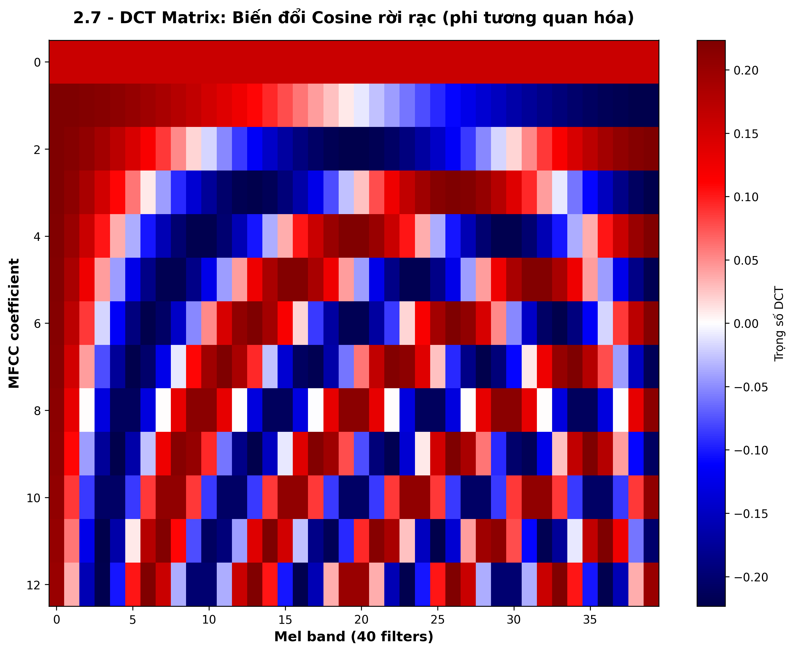

**Quan sát:**
- Ma trận DCT có kích thước $13 \times 40$
- Mỗi hàng là một hệ số cosine cơ sở
- Hàng đầu tiên (MFCC 0) là hằng số → thể hiện năng lượng trung bình
- Các hàng tiếp theo dao động với tần số ngày càng tăng

### 2.8. Kết quả: MFCC Features

**Output cuối cùng:** Vector MFCC gồm 13 coefficients cho mỗi khung.

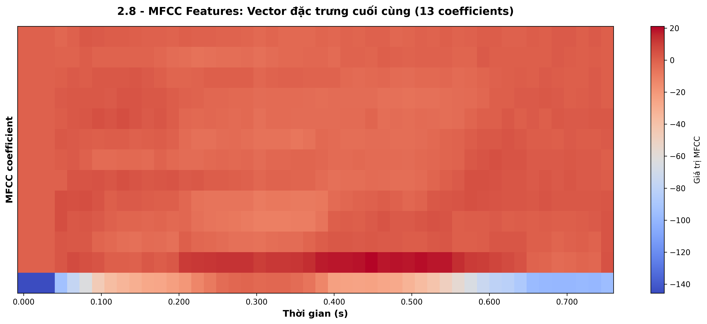

**Quan sát:**
- Trục X: Thời gian (các khung)
- Trục Y: 13 MFCC coefficients
- **MFCC 0** (dòng dưới cùng): Năng lượng tổng thể (thường bị bỏ qua trong nhận dạng)
- **MFCC 1-12**: Mô tả "hình dạng" của đường bao phổ (spectral envelope)

**Ý nghĩa vật lý:**
- **MFCC thấp (1-4)**: Thông tin về hình dạng tổng thể của formant (nguyên âm)
- **MFCC trung bình (5-9)**: Chi tiết về formant
- **MFCC cao (10-12)**: Đặc trưng tinh tế, phụ âm

### 2.9. Tổng kết MFCC

**Từ hàng vạn mẫu → Vài chục vector súc tích:**

| Giai đoạn | Kích thước dữ liệu |
|-----------|-------------------|
| Raw audio (0.79s @ 16kHz) | 12,672 mẫu |
| STFT Power Spectrum | 257 freq bins × 49 frames = 12,593 giá trị |
| Mel Spectrum | 40 Mel bands × 49 frames = 1,960 giá trị |
| **MFCC** | **13 coeffs × 49 frames = 637 giá trị** |

→ **Giảm ~95% dữ liệu** trong khi vẫn giữ đầy đủ thông tin quan trọng!

### 2.10. Ứng dụng trong dự án

MFCC được sử dụng trong:
- **Task 3: Recognition (DTW)** (`src/recognition/dtw.py`): So sánh MFCC của hai file âm thanh để nhận dạng
- **GUI** (`src/gui/main_window.py`): Hiển thị đặc trưng MFCC real-time

**Code snippet từ `mfcc.py`:**
```python
def mfcc(signal, sample_rate, n_mfcc=13, n_fft=512, 
         hop_length=256, n_filters=40):
    # 1. STFT
    stft_matrix = stft(signal, n_fft=n_fft, hop_length=hop_length)
    
    # 2. Power Spectrum
    power_spectrum = np.abs(stft_matrix) ** 2
    
    # 3. Mel Filterbank
    mel_filters = mel_filterbank(n_filters, n_fft, sample_rate)
    mel_spectrum = np.dot(mel_filters, power_spectrum)
    
    # 4. Logarithm
    log_mel_spectrum = np.log(mel_spectrum + 1e-10)
    
    # 5. DCT
    dct_mat = dct_matrix(n_filters, n_mfcc)
    mfcc_features = np.dot(dct_mat, log_mel_spectrum)
    
    return mfcc_features
```

---

## PHẦN III: LPC (LINEAR PREDICTIVE CODING)

### 3.1. Giới thiệu

**LPC** (Mã hóa dự đoán tuyến tính) là một phương pháp mô hình hóa **đường phát âm** (vocal tract) của con người. Không giống như MFCC tập trung vào "cái gì được nói", LPC tập trung vào "cơ chế phát âm như thế nào".

**Ý tưởng cốt lõi:** Dự đoán mẫu hiện tại dựa trên tổ hợp tuyến tính của $p$ mẫu trước đó:

$$
\hat{x}[n] = \sum_{k=1}^{p} a_k \cdot x[n-k]
$$

Trong đó:
- $\hat{x}[n]$: Giá trị dự đoán
- $a_k$: Hệ số LPC (cần tìm)
- $p$: Bậc LPC (order)

**Lỗi dự đoán:**

$$
e[n] = x[n] - \hat{x}[n] = x[n] - \sum_{k=1}^{p} a_k \cdot x[n-k]
$$

**Mục tiêu:** Tìm các hệ số $a_k$ sao cho tổng bình phương lỗi **nhỏ nhất**.

### 3.2. Quy trình LPC


### 3.3. Bước 1 & 2: Framing và Pre-emphasis

Tương tự MFCC:
- **Frame length:** 400 mẫu (25ms @ 16kHz)
- **Hop length:** 160 mẫu (10ms) → Overlap 60%
- **Pre-emphasis:** $\alpha = 0.97$

### 3.4. Bước 3: Autocorrelation (Tự tương quan)

**Hàm tự tương quan** đo độ tương đồng giữa tín hiệu và phiên bản trễ của chính nó:

$$
R[k] = \sum_{n=0}^{N-1-k} x[n] \cdot x[n+k], \quad k = 0, 1, ..., p
$$

Trong đó:
- $R[0]$: Năng lượng tổng thể của khung
- $R[k]$ với $k > 0$: Độ tương quan với độ trễ $k$

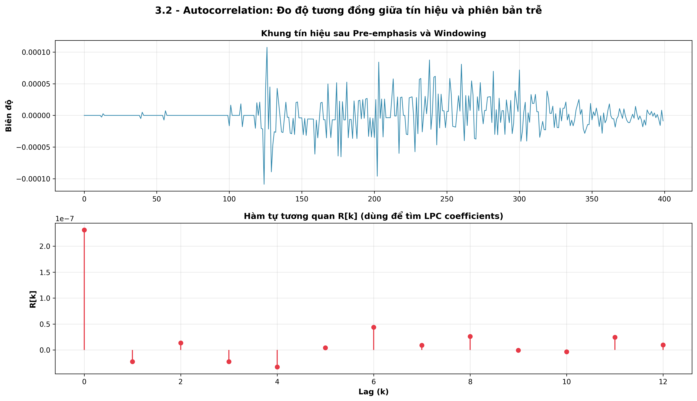

**Quan sát:**
- **Trên:** Khung tín hiệu đã qua pre-emphasis và windowing
- **Dưới:** 
  - $R[0]$ cao nhất (tín hiệu tương quan hoàn toàn với chính nó)
  - $R[k]$ giảm dần khi $k$ tăng

### 3.5. Bước 4: Levinson-Durbin Algorithm

Đây là **thuật toán then chốt** của LPC. Nó giải hệ phương trình **Toeplitz** (hệ phương trình Yule-Walker):

$$
\begin{bmatrix}
R[0] & R[1] & \cdots & R[p-1] \\
R[1] & R[0] & \cdots & R[p-2] \\
\vdots & \vdots & \ddots & \vdots \\
R[p-1] & R[p-2] & \cdots & R[0]
\end{bmatrix}
\begin{bmatrix}
a_1 \\
a_2 \\
\vdots \\
a_p
\end{bmatrix}
=
\begin{bmatrix}
R[1] \\
R[2] \\
\vdots \\
R[p]
\end{bmatrix}
$$

**Tại sao không dùng phép nghịch đảo ma trận trực tiếp?**

| Phương pháp | Độ phức tạp | Ghi chú |
|-------------|-------------|---------|
| Nghịch đảo ma trận | $O(p^3)$ | Chậm và không ổn định số học |
| **Levinson-Durbin** | **$O(p^2)$** | **Nhanh và tận dụng cấu trúc Toeplitz** |

#### Thuật toán Levinson-Durbin:

**Khởi tạo:**
```
E⁽⁰⁾ = R[0]          // Lỗi dự đoán ban đầu
```

**Vòng lặp** (với $i = 1, 2, ..., p$):

1. **Tính hệ số phản xạ** (reflection coefficient):
   $$
   \lambda_i = \frac{R[i] - \sum_{j=1}^{i-1} a_j^{(i-1)} \cdot R[i-j]}{E^{(i-1)}}
   $$

2. **Cập nhật hệ số LPC:**
   $$
   a_i^{(i)} = \lambda_i
   $$
   $$
   a_j^{(i)} = a_j^{(i-1)} - \lambda_i \cdot a_{i-j}^{(i-1)}, \quad j = 1, ..., i-1
   $$

3. **Cập nhật lỗi:**
   $$
   E^{(i)} = E^{(i-1)} \cdot (1 - \lambda_i^2)
   $$

**Output:** Các hệ số LPC cuối cùng là $a_1^{(p)}, a_2^{(p)}, ..., a_p^{(p)}$

**Code snippet từ `lpc.py`:**
```python
def levinson_durbin(r, order):
    a = np.zeros(order, dtype=np.float32)
    e = r[0]  # Lỗi dự đoán
    
    for i in range(order):
        # Tính hệ số phản xạ
        lambda_i = r[i + 1]
        for j in range(i):
            lambda_i -= a[j] * r[i - j]
        lambda_i /= e
        
        # Cập nhật hệ số
        a[i] = lambda_i
        for j in range(i // 2 + 1):
            temp = a[j]
            a[j] -= lambda_i * a[i - j - 1]
            if j != i - j - 1:
                a[i - j - 1] -= lambda_i * temp
        
        # Cập nhật lỗi
        e *= (1 - lambda_i * lambda_i)
    
    return a
```

### 3.6. Kết quả: LPC Coefficients

**Output:** Vector LPC gồm 12 coefficients cho mỗi khung.

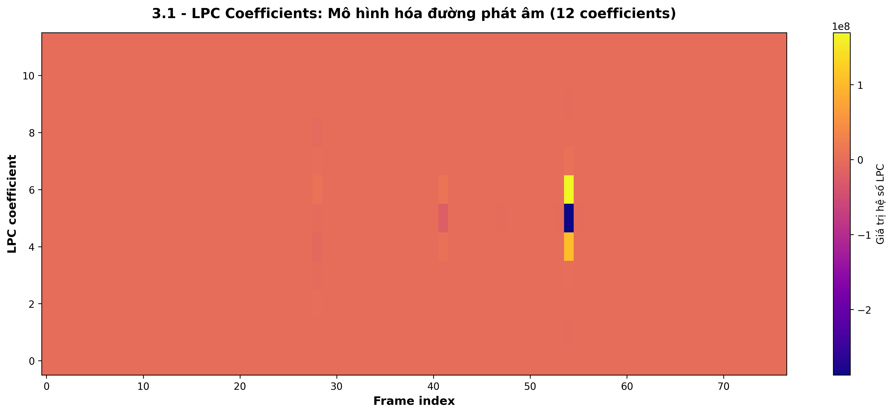

**Quan sát:**
- Trục X: Frame index
- Trục Y: 12 LPC coefficients
- Màu sắc thể hiện giá trị của hệ số

### 3.7. Bậc LPC (LPC Order)

**Quy tắc ngón tay cái:**

$$
p = \frac{f_s}{1000} + 2
$$

- Với $f_s = 16$ kHz → $p = 16 + 2 \approx 12$ (chuẩn cho giọng nói)
- Với $f_s = 8$ kHz → $p = 8 + 2 = 10$

**Ý nghĩa vật lý:**
- Mỗi cặp hệ số LPC mô hình hóa một **formant** (đỉnh cộng hưởng) của đường phát âm
- Với 12 hệ số → Có thể mô hình hóa ~5-6 formants (đủ cho hầu hết nguyên âm tiếng Việt)

### 3.8. LPC vs MFCC

| Khía cạnh | MFCC | LPC |
|-----------|------|-----|
| **Nguồn gốc** | Miền tần số (phổ) | Miền thời gian (dự đoán) |
| **Mô hình** | Tai người (thính giác) | Đường phát âm (sinh lý) |
| **Độ phức tạp** | Cao (6 bước) | Trung bình (4 bước) |
| **Ứng dụng chính** | Nhận dạng giọng nói | Phân tích formant, nén âm thanh |
| **Ưu điểm** | Robust với nhiễu, phổ biến | Hiệu quả tính toán, mô hình vật lý rõ ràng |
| **Nhược điểm** | Tính toán phức tạp | Nhạy cảm với nhiễu |

### 3.9. Ứng dụng trong dự án

LPC có thể được sử dụng thay thế MFCC trong:
- **Recognition (DTW)**: So sánh LPC coefficients thay vì MFCC
- **Speech Analysis**: Phân tích formant của các nguyên âm tiếng Việt

**Ví dụ:** File `src/features/lpc.py` cung cấp hàm `lpc_to_cepstrum()` để chuyển đổi LPC sang cepstral coefficients (tương tự MFCC) cho DTW.

---

## KẾT LUẬN

### So sánh tổng quan

| Tiêu chí | STFT | MFCC | LPC |
|----------|------|------|-----|
| **Miền phân tích** | Thời gian-Tần số | Cepstral (qua Mel) | Thời gian |
| **Số đặc trưng** | ~257 bins/frame | 13 coeffs/frame | 12 coeffs/frame |
| **Độ phức tạp** | Trung bình | Cao | Trung bình |
| **Ứng dụng** | Visualization, NMF | Nhận dạng (DTW) | Phân tích formant |
| **Ưu điểm** | Trực quan, toàn diện | Robust, chuẩn công nghiệp | Nhanh, mô hình vật lý |

### Luồng xử lý trong dự án

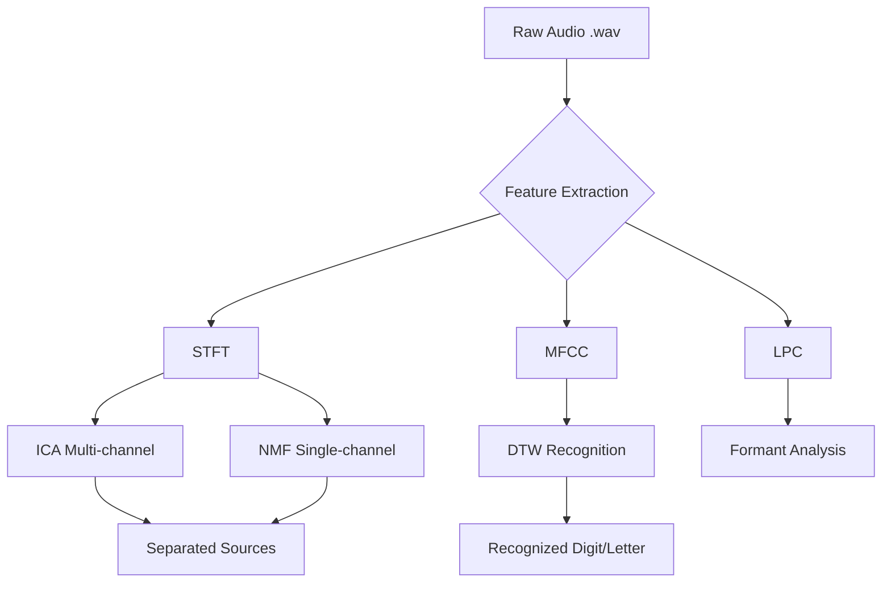

### Tài liệu tham khảo

1. **F.J. Owens** - "Signal Processing of Speech" (Sách giáo trình chính)
2. **Douglas O'Shaughnessy** - "Speech Communications: Human and Machine" (Lý thuyết MFCC)
3. **Lawrence Rabiner & Ronald Schafer** - "Theory and Applications of Digital Speech Processing" (Levinson-Durbin)
4. **Code implementation:** `src/features/*.py` (STFT, MFCC, LPC)

### Lời cảm ơn

Báo cáo này được tạo ra dựa trên việc phân tích chi tiết file `digit_0.wav` và code triển khai thực tế trong dự án. Tất cả các hình ảnh minh họa được tạo tự động bằng script `generate_feature_visualizations.py`.

---

**Ghi chú:** Báo cáo này được tạo ra cho mục đích học tập và trình bày. Nếu sử dụng trong báo cáo chính thức, vui lòng điền đầy đủ thông tin tác giả và tham khảo nguồn.
