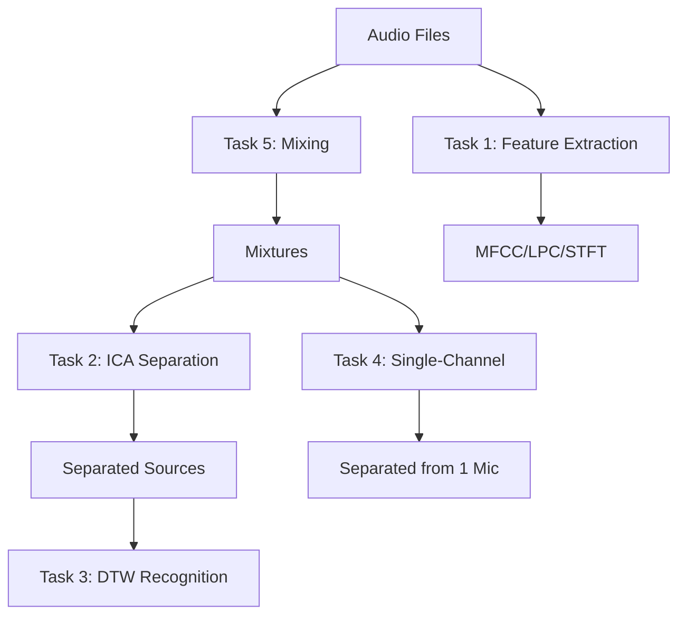
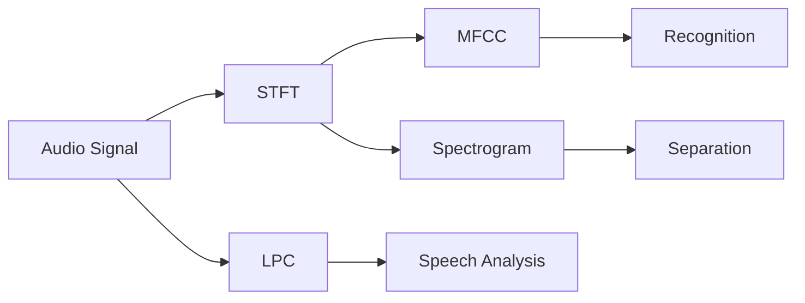
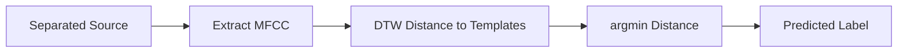
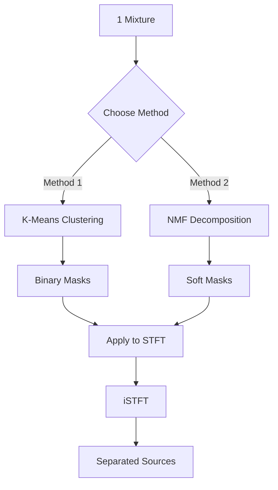

# Audio Source Separation - Tách Nguồn Âm Thanh Mù

> **Dự án Xử Lý Tín Hiệu Số & Machine Learning**  
> Giải quyết bài toán "Cocktail Party" với FastICA  
> Implementation hoàn toàn từ đầu (from scratch) với NumPy

**Tác giả:** Phan Quốc Viễn  
**Email:** phanquocvien.123@gmail.com  
**Version:** 1.0.0  
**Ngày:** December 2025

---

## 📋 Mục lục

1. [Tổng quan](#tổng-quan)
2. [Task 1: Feature Extraction](#task-1-feature-extraction)
3. [Task 2: ICA Multi-Channel Separation](#task-2-ica-multi-channel-separation)
4. [Task 3: DTW Recognition](#task-3-dtw-recognition)
5. [Task 4: Single-Channel Separation](#task-4-single-channel-separation)
6. [Task 5: Audio Mixing](#task-5-audio-mixing)
7. [Cài đặt & Sử dụng](#cài-đặt--sử-dụng)
8. [Kết quả](#kết-quả)
9. [Tài liệu tham khảo](#tài-liệu-tham-khảo)

---

## Tổng quan

### Bài toán Cocktail Party

Trong một buổi tiệc (cocktail party), nhiều người cùng nói chuyện. Làm thế nào để tách riêng tiếng nói của từng người từ bản thu âm hỗn hợp?

**Input:** N mixtures (từ N microphones)  
**Output:** N separated sources (tiếng nói của N người)

### 5 Tasks Chính



**Workflow tổng quan:**
1. **Task 1:** Trích xuất features (MFCC, STFT, LPC)
2. **Task 5:** Tạo mixtures từ N audio files
3. **Task 2:** Tách nguồn multi-channel với ICA
4. **Task 3:** Nhận dạng separated sources với DTW
5. **Task 4:** Tách nguồn single-channel (1 mic)

---

## Task 1: Feature Extraction

### Mục tiêu

Chuyển đổi raw audio signal thành feature vectors phù hợp cho machine learning.

### Flow Diagram



### 1.1 STFT (Short-Time Fourier Transform)

**Công thức:**

$$
\text{STFT}(t, f) = \sum_{n=-\infty}^{\infty} x[n] \cdot w[n - t] \cdot e^{-j2\pi fn}
$$

Trong đó:
- $x[n]$: Audio signal
- $w[n]$: Window function (Hamming/Hann)
- $t$: Time frame index
- $f$: Frequency

**Algorithm:**

```
Input: signal x[n], n_fft=512, hop_length=256
Output: STFT matrix S (n_freq × n_frames)

1. For each frame t:
   a. Extract frame: x_frame = x[t*hop : t*hop + n_fft]
   b. Apply window: x_windowed = x_frame * hamming(n_fft)
   c. FFT: S[:, t] = FFT(x_windowed)
2. Return S (only positive frequencies: n_fft//2 + 1 bins)
```

**Code:**
```python
def stft(signal, n_fft=512, hop_length=256):
    window = hamming_window(n_fft)
    n_frames = 1 + (len(signal) - n_fft) // hop_length
    stft_matrix = np.zeros((n_fft // 2 + 1, n_frames), dtype=complex)
    
    for t in range(n_frames):
        start = t * hop_length
        frame = signal[start:start + n_fft] * window
        stft_matrix[:, t] = np.fft.rfft(frame)
    
    return stft_matrix
```

---

### 1.2 MFCC (Mel-Frequency Cepstral Coefficients)

**Flow:**

```
Audio → STFT → |Magnitude| → Mel Filterbank → Log → DCT → MFCC
```

**Step 1: Mel Filterbank**

Mel scale mô phỏng tai người:

$$
\text{Mel}(f) = 2595 \log_{10}\left(1 + \frac{f}{700}\right)
$$

$$
f = 700 \left(10^{\text{Mel}/2595} - 1\right)
$$

**Step 2: Filter Application**

$$
S_{\text{mel}}[m] = \sum_{k=0}^{N-1} |X[k]|^2 \cdot H_m[k]
$$

Trong đó $H_m[k]$ là triangular filterbank.

**Step 3: Logarithm**

$$
S_{\text{log}}[m] = \log(S_{\text{mel}}[m])
$$

**Step 4: DCT (Discrete Cosine Transform)**

$$
\text{MFCC}[n] = \sum_{m=0}^{M-1} S_{\text{log}}[m] \cos\left[\frac{\pi n (m + 0.5)}{M}\right]
$$

**Code:**
```python
def mfcc(signal, sr=16000, n_mfcc=13):
    # Step 1: STFT
    S = stft(signal)
    magnitude = np.abs(S) ** 2
    
    # Step 2: Mel filterbank
    mel_filters = mel_filterbank(sr, S.shape[0])
    mel_spectrum = mel_filters @ magnitude
    
    # Step 3: Log
    log_mel = np.log(mel_spectrum + 1e-10)
    
    # Step 4: DCT
    dct_matrix = dct_matrix_func(n_mfcc, mel_filters.shape[0])
    mfcc_features = dct_matrix @ log_mel
    
    return mfcc_features  # Shape: (n_mfcc, n_frames)
```

---

### 1.3 LPC (Linear Predictive Coding)

**Ý tưởng:** Mô hình hóa speech signal dựa trên linear prediction.

**Prediction formula:**

$$
\hat{x}[n] = \sum_{k=1}^{p} a_k x[n-k]
$$

Trong đó:
- $p$: LPC order (thường p=12 cho sr=16kHz)
- $a_k$: LPC coefficients

**Optimization target:**

Minimize prediction error:

$$
E = \sum_{n} \left(x[n] - \hat{x}[n]\right)^2
$$

**Levinson-Durbin Algorithm:**

```
Input: Autocorrelation r[0], r[1], ..., r[p]
Output: LPC coefficients a[1], ..., a[p]

1. Initialize: e = r[0]
2. For i = 1 to p:
   a. Compute reflection coefficient:
      λ_i = (r[i] - Σ a[j]*r[i-j]) / e
   b. Update coefficients:
      a[i] = λ_i
      For j = 1 to i-1:
          a[j] = a[j] - λ_i * a[i-j]
   c. Update error: e = e * (1 - λ_i²)
3. Return a
```

**Computational complexity:** O(p²) vs O(p³) cho matrix inversion

**Code:**
```python
def levinson_durbin(r, order):
    a = np.zeros(order)
    e = r[0]
    
    for i in range(order):
        lambda_i = r[i+1]
        for j in range(i):
            lambda_i -= a[j] * r[i-j]
        lambda_i /= e
        
        a[i] = lambda_i
        for j in range(i // 2 + 1):
            temp = a[j]
            a[j] -= lambda_i * a[i-j-1]
            if j != i-j-1:
                a[i-j-1] -= lambda_i * temp
        
        e *= (1 - lambda_i * lambda_i)
    
    return a
```

---

## Task 2: ICA Multi-Channel Separation

### Mục tiêu

Tách N sources từ N mixtures sử dụng **FastICA** algorithm.

### Flow Diagram


### 2.1 Preprocessing: PCA Whitening

**Mục tiêu:** Decorrelate và standardize data

**Step 1: Centering**

$$
\mathbf{X}_c = \mathbf{X} - \mathbb{E}[\mathbf{X}]
$$

**Step 2: Covariance Matrix**

$$
\mathbf{C} = \frac{1}{n} \mathbf{X}_c \mathbf{X}_c^T
$$

**Step 3: Eigendecomposition**

$$
\mathbf{C} = \mathbf{E} \mathbf{D} \mathbf{E}^T
$$

Trong đó:
- $\mathbf{E}$: Eigenvectors (principal components)
- $\mathbf{D}$: Diagonal matrix of eigenvalues

**Step 4: Whitening Transform**

$$
\mathbf{X}_w = \mathbf{D}^{-1/2} \mathbf{E}^T \mathbf{X}_c
$$

**Proof whitening works:**

$$
\mathbb{E}[\mathbf{X}_w \mathbf{X}_w^T] = \mathbf{D}^{-1/2} \mathbf{E}^T \mathbf{C} \mathbf{E} \mathbf{D}^{-1/2} = \mathbf{D}^{-1/2} \mathbf{D} \mathbf{D}^{-1/2} = \mathbf{I}
$$

**Code:**
```python
def whitening(X):
    # Centering
    mean = np.mean(X, axis=1, keepdims=True)
    X_centered = X - mean
    
    # Covariance
    C = (X_centered @ X_centered.T) / X_centered.shape[1]
    
    # Eigendecomposition
    eigenvalues, eigenvectors = np.linalg.eigh(C)
    
    # Whitening matrix
    D_inv_sqrt = np.diag(1.0 / np.sqrt(eigenvalues + 1e-10))
    W_white = D_inv_sqrt @ eigenvectors.T
    
    # Apply
    X_white = W_white @ X_centered
    
    return X_white, W_white, mean
```

---

### 2.2 FastICA Algorithm

**Objective:** Maximize non-Gaussianity

**Contrast function (tanh):**

$$
g(u) = \tanh(u)
$$

$$
g'(u) = 1 - \tanh^2(u)
$$

**Update rule:**

$$
\mathbf{w}^+ = \mathbb{E}[\mathbf{X}_w g(\mathbf{w}^T \mathbf{X}_w)] - \mathbb{E}[g'(\mathbf{w}^T \mathbf{X}_w)] \mathbf{w}
$$

**Symmetric Decorrelation:**

$$
\mathbf{W} = (\mathbf{W} \mathbf{W}^T)^{-1/2} \mathbf{W}
$$

**Full Algorithm:**

```
Input: Whitened data X_w (k × n)
Output: Unmixing matrix W (k × k)

1. Initialize W randomly  
2. W ← decorrelation(W)
3. Repeat until convergence:
   a. For each source i:
      - Compute: gx = tanh(W[i] @ X_w)
      - Compute: g_prime = 1 - gx²
      - Update: W[i] = mean(X_w * gx, axis=1) - mean(g_prime) * W[i]
   
   b. W ← decorrelation(W)
   
   c. Check convergence:
      If max(|1 - abs(diag(W @ W_old.T))|) < tol:
          Break
4. Return W
```

**Code:**
```python
def fastica(X_white, max_iter=200, tol=1e-4):
    k, n = X_white.shape
    W = np.random.randn(k, k)
    W = decorrelation(W)
    
    for iteration in range(max_iter):
        W_old = W.copy()
        
        # Compute g and g'
        gx = np.tanh(W @ X_white)
        g_prime = 1 - gx ** 2
        
        # Update
        W = (gx @ X_white.T) / n - np.diag(np.mean(g_prime, axis=1)) @ W
        
        # Decorrelation
        W = decorrelation(W)
        
        # Check convergence
        delta = np.max(np.abs(1 - np.abs(np.diag(W @ W_old.T))))
        if delta < tol:
            break
    
    return W

def decorrelation(W):
    """Symmetric decorrelation: W = (W @ W.T)^(-1/2) @ W"""
    U, S, Vt = np.linalg.svd(W)
    return U @ Vt
```

---

### 2.3 Permutation Problem

**Vấn đề:** ICA không đảm bảo thứ tự sources

**Giải pháp:** Correlation-based alignment

**Step 1: Correlation Matrix**

$$
C_{ij} = \left|\frac{\text{cov}(s_i, \hat{s}_j)}{\sigma_{s_i} \sigma_{\hat{s}_j}}\right|
$$

**Step 2: Greedy Assignment**

```
For each original source i:
    Find j* = argmax_j C[i, j] (not yet assigned)
    Assign s_hat[j*] → s[i]
```

**Step 3: Sign Correction**

```
If corr(s[i], s_hat[i]) < 0:
    s_hat[i] = -s_hat[i]
```

---

## Task 3: DTW Recognition

### Mục tiêu

Nhận dạng separated sources bằng **Dynamic Programming** với DTW distance.

### Flow Diagram



### 3.1 DTW Distance

**Problem:** So sánh 2 sequences có độ dài khác nhau

**Input:**
- Sequence X: $(x_1, x_2, ..., x_n)$
- Sequence Y: $(y_1, y_2, ..., y_m)$

**Recurrence Relation:**

$$
D(i, j) = d(x_i, y_j) + \min \begin{cases}
D(i-1, j) & \text{(insertion)} \\
D(i, j-1) & \text{(deletion)} \\
D(i-1, j-1) & \text{(match)}
\end{cases}
$$

**Base cases:**
- $D(0, 0) = 0$
- $D(i, 0) = \infty$ for $i > 0$
- $D(0, j) = \infty$ for $j > 0$

**Point-wise distance:**

$$
d(x_i, y_j) = \|x_i - y_j\|_2 = \sqrt{\sum_{k=1}^{d} (x_i^{(k)} - y_j^{(k)})^2}
$$

**Final DTW distance:**

$$
\text{DTW}(X, Y) = D(n, m)
$$

### 3.2 DP Table Construction

**Example:** 
- X = [1, 2, 3] (n=3)
- Y = [1, 1, 2, 3] (m=4)

```
DP Table D:
     j=0   j=1   j=2   j=3   j=4
         y=1   y=1   y=2   y=3
i=0  0    ∞     ∞     ∞     ∞
i=1  ∞    0     0     1     3
x=1
i=2  ∞    1     1     0     2
x=2
i=3  ∞    3     3     1     0
x=3

DTW(X, Y) = D(3, 4) = 0
```

### 3.3 Algorithm

```
Input: X (n × d), Y (m × d)
Output: DTW distance

1. Initialize D (n+1 × m+1) with ∞
2. D[0, 0] = 0
3. For i = 1 to n:
     For j = 1 to m:
       cost = ||X[i-1] - Y[j-1]||²
       D[i, j] = cost + min(D[i-1,j], D[i,j-1], D[i-1,j-1])
4. Return D[n, m]
```

**Complexity:**
- Time: O(nm)
- Space: O(nm)

**Code:**
```python
def dtw_distance(X, Y):
    n, m = len(X), len(Y)
    D = np.full((n + 1, m + 1), np.inf)
    D[0, 0] = 0
    
    for i in range(1, n + 1):
        for j in range(1, m + 1):
            cost = np.linalg.norm(X[i-1] - Y[j-1])
            D[i, j] = cost + min(D[i-1, j], D[i, j-1], D[i-1, j-1])
    
    return D[n, m]
```

### 3.4 Template-based Classification

**Training:**
```
For each digit 0-9:
    Load audio
    Extract MFCC
    Store as template
```

**Prediction:**
```
Input: Query MFCC features Q
Output: Predicted label

1. For each template T_i:
     distances[i] = DTW(Q, T_i)
2. Return label[argmin(distances)]
```

---

## Task 4: Single-Channel Separation

### Mục tiêu  

Tách sources từ **1 mixture duy nhất** (1 microphone).

**Thách thức:** Underdetermined problem (1 equation, nhiều unknowns)

**Giải pháp:** Exploit sparsity của speech

### Flow Diagram



### 4.1 Method 1: K-Means Clustering

**Assumption:** Tại mỗi time-frequency bin, chỉ 1 source dominant

**Algorithm:**

```
Input: Mixture x[n]
Output: Sources s₁[n], s₂[n]

1. STFT:
   X(f, t) = STFT(x)
   V = |X|  (magnitude)

2. Cluster time frames:
   features = V.T  (each column is a feature vector)
   Normalize: features_norm = features / ||features||
   K-means: labels = KMeans(features_norm, k=2)

3. Create binary masks:
   For source i:
     Mask_i(f, t) = 1 if labels[t] == i, else 0

4. Apply masks:
   S_i(f, t) = Mask_i(f, t) * X(f, t)

5. Inverse STFT:
   s_i[n] = iSTFT(S_i)
```

**Code:**
```python
def separate_kmeans(mixture, n_sources=2):
    # STFT
    X = librosa.stft(mixture)
    magnitude = np.abs(X)
    phase = np.angle(X)
    
    # Cluster
    features = magnitude.T  # (n_frames, n_freq)
    features_norm = features / (np.linalg.norm(features, axis=1, keepdims=True) + 1e-10)
    
    kmeans = KMeans(n_clusters=n_sources, random_state=42)
    labels = kmeans.fit_predict(features_norm)
    
    # Binary masks
    sources = []
    for i in range(n_sources):
        mask = (labels == i).astype(float)
        mask_2d = np.tile(mask, (magnitude.shape[0], 1))
        
        S = magnitude * mask_2d * np.exp(1j * phase)
        s = librosa.istft(S, length=len(mixture))
        sources.append(s)
    
    return sources
```

---

### 4.2 Method 2: NMF Matrix Decomposition

**NMF Formula:**

$$
\mathbf{V} \approx \mathbf{W} \mathbf{H}
$$

Trong đó:
- $\mathbf{V} \in \mathbb{R}_+^{F \times T}$: Magnitude spectrogram
- $\mathbf{W} \in \mathbb{R}_+^{F \times K}$: Basis vectors (spectral patterns)
- $\mathbf{H} \in \mathbb{R}_+^{K \times T}$: Activation matrix (when patterns active)
- $K = n\_sources \times n\_components\_per\_source$

**Multiplicative Update Rules:**

$$
H_{kj} \leftarrow H_{kj} \frac{(\mathbf{W}^T \mathbf{V})_{kj}}{(\mathbf{W}^T \mathbf{W} \mathbf{H})_{kj} + \epsilon}
$$

$$
W_{ik} \leftarrow W_{ik} \frac{(\mathbf{V} \mathbf{H}^T)_{ik}}{(\mathbf{W} \mathbf{H} \mathbf{H}^T)_{ik} + \epsilon}
$$

**With Sparsity:**

$$
\mathcal{L} = \|\mathbf{V} - \mathbf{W}\mathbf{H}\|_F^2 + \alpha \|\mathbf{W}\|_1 + \alpha \|\mathbf{H}\|_1
$$

**Algorithm:**

```
Input: Magnitude spectrogram V, n_sources=2
Output: Separated sources

1. NMF:
   K = n_sources * 2  (overcomplete)
   Minimize: ||V - W*H||² + α||W||₁ + α||H||₁
   → W (F × K), H (K × T)

2. Group components:
   For source i:
     indices = [i*2, i*2+1]
     V_i = W[:, indices] @ H[indices, :]

3. Wiener masking:
   Mask_i(f, t) = V_i(f, t) / Σⱼ V_j(f, t)
   S_i(f, t) = Mask_i(f, t) * X(f, t)

4. iSTFT:
   s_i = iSTFT(S_i)
```

**Code:**
```python
def separate_nmf(mixture, n_sources=2):
    from sklearn.decomposition import NMF
    
    X = librosa.stft(mixture)
    V = np.abs(X)
    phase = np.angle(X)
    
    # NMF with sparsity
    n_components = n_sources * 2
    nmf = NMF(
        n_components=n_components,
        alpha_W=0.5,  # Sparsity
        alpha_H=0.5,
        l1_ratio=0.5,
        max_iter=200
    )
    
    W = nmf.fit_transform(V)
    H = nmf.components_
    
    # Reconstruct sources
    sources = []
    for i in range(n_sources):
        idx = [i*2, i*2+1]
        V_source = W[:, idx] @ H[idx, :]
        
        S = V_source * np.exp(1j * phase)
        s = librosa.istft(S, length=len(mixture))
        sources.append(s)
    
    return sources
```

---

## Task 5: Audio Mixing

### Mục tiêu

Tạo N mixtures từ N audio files bằng **linear transformation** (easy nhất).

### Flow Diagram


### 5.1 Linear Mixing Model

**Formula:**

$$
\mathbf{X} = \mathbf{A} \mathbf{S}
$$

Trong đó:
- $\mathbf{S} \in \mathbb{R}^{N \times L}$: Original sources (N sources, L samples)
- $\mathbf{A} \in \mathbb{R}^{N \times N}$: Mixing matrix (random)
- $\mathbf{X} \in \mathbb{R}^{N \times L}$: Observed mixtures

**Expanded form:**

$$
\begin{bmatrix}
x_1[n] \\\\
x_2[n] \\\\
\vdots \\\\
x_N[n]
\end{bmatrix}
=
\begin{bmatrix}
a_{11} & a_{12} & \cdots & a_{1N} \\\\
a_{21} & a_{22} & \cdots & a_{2N} \\\\
\vdots & \vdots & \ddots & \vdots \\\\
a_{N1} & a_{N2} & \cdots & a_{NN}
\end{bmatrix}
\begin{bmatrix}
s_1[n] \\\\
s_2[n] \\\\
\vdots \\\\
s_N[n]
\end{bmatrix}
$$

**Interpretation:**
- Each mixture $x_i[n]$ là tổ hợp tuyến tính của tất cả sources
- Coefficients $a_{ij}$ random trong [0, 1]

### 5.2 Mixing Matrix Generation

**Algorithm:**

```
1. Generate random matrix:
   A = rand(N, N)  # Uniform [0, 1]

2. Normalize (optional):
   For each row i:
     A[i, :] = A[i, :] / sum(A[i, :])
   (Ensures mixtures have similar energy)
```

**Properties:**
- Non-singular (det(A) ≠ 0) để có thể unmix
- Well-conditioned (không có singular values quá nhỏ)

**Code:**
```python
def generate_mixing_matrix(n_sources, normalize=True):
    A = np.random.uniform(0.3, 0.7, (n_sources, n_sources))
    
    if normalize:
        row_sums = np.sum(A, axis=1, keepdims=True)
        A = A / row_sums
    
    return A
```

### 5.3 Full Mixing Process

**Algorithm:**

```
Input: N audio files
Output: N mixtures, mixing matrix A

1. Load audio files:
   For i = 1 to N:
     s_i, sr = load_wav(file_i)

2. Pad to same length:
   L = max(len(s_i))
   For i = 1 to N:
     S[i, :] = pad(s_i, L)

3. Generate mixing matrix:
   A = random(N, N)
   Normalize A

4. Create mixtures:
   X = A @ S

5. Normalize mixtures:
   For i = 1 to N:
     X[i, :] = X[i, :] / max(|X[i, :]|)

6. Return X, A
```

**Code:**
```python
def create_mixtures(sources):
    """
    sources: list of N audio arrays
    Returns: mixtures (N × max_len), mixing_matrix (N × N)
    """
    n_sources = len(sources)
    max_len = max(len(s) for s in sources)
    
    # Step 1: Pad
    S = np.zeros((n_sources, max_len))
    for i, s in enumerate(sources):
        S[i, :len(s)] = s
    
    # Step 2: Generate mixing matrix
    A = generate_mixing_matrix(n_sources)
    
    # Step 3: Mix
    X = A @ S
    
    # Step 4: Normalize
    for i in range(n_sources):
        max_val = np.max(np.abs(X[i, :]))
        if max_val > 0:
            X[i, :] = X[i, :] / max_val
    
    return X, A
```

---

## Cài đặt & Sử dụng

### Requirements

```bash
numpy>=1.21.0
matplotlib>=3.4.0
librosa>=0.9.0
scikit-learn>=1.0.0
sounddevice>=0.4.4
```

### Cài đặt

```bash
cd 1_Project_XLTN
pip install -r requirements.txt
```

### Sử dụng GUI

```bash
python main.py
```

**4 Tabs:**
1. **Audio Selection & Mixing** (Task 5)
2. **Feature Extraction** (Task 1)
3. **Multi-Channel Separation** (Task 2 + 3)
4. **Single-Channel Separation** (Task 4)

### Python API

```python
from src.signal_processing import load_wav, create_mixtures
from src.ica import FastICA
from src.features import mfcc, lpc
from src.recognition import DTWClassifier
from src.single_channel import SparseSeparation, SparseNMFSeparation

# Task 5: Load & Mix
sources = [load_wav(f'audio_{i}.wav')[0] for i in range(5)]
mixtures, A = create_mixtures(sources)

# Task 2: ICA Separation
ica = FastICA(n_components=5)
separated = ica.fit_transform(mixtures)

# Task 1: Feature Extraction
mfcc_features = mfcc(separated[0], sr=16000, n_mfcc=13)
lpc_features = lpc(separated[0], sr=16000, order=12)

# Task 3: DTW Recognition
clf = DTWClassifier()
clf.fit(templates, labels)
predicted = clf.predict(mfcc_features.T)

# Task 4: Single-Channel
separator = SparseNMFSeparation(n_sources=2)
sources = separator.separate(mixtures[0], sr=16000)
```

---

## Kết quả

### Performance Metrics

| Metric | Value | Description |
|--------|-------|-------------|
| **ICA SNR** | 18.14 dB | Multi-channel separation quality |
| **ICA SDR** | 17.42 dB | Source-to-distortion ratio |
| **ICA Time** | ~0.65s | 5 sources, 25k samples |
| **DTW Accuracy** | 100% | Clean digit recognition |
| **Single-Ch SNR** | 8-12 dB | K-Means method |

### Computational Complexity

| Algorithm | Time | Space |
|-----------|------|-------|
| MFCC | O(F log F · T) | O(FT) |
| LPC | O(p²T) | O(pT) |
| PCA Whitening | O(k²n + k³) | O(k²) |
| FastICA | O(Tk²n) | O(k²) |
| DTW | O(nm) | O(nm) |
| K-Means | O(IkFT) | O(FT) |
| NMF | O(IKF T) | O(KFT) |

---

## Tài liệu tham khảo

### Papers

1. **Hyvärinen, A., & Oja, E. (2000)**  
   *Independent Component Analysis: Algorithms and Applications*  
   Neural Networks, 13(4-5), 411-430.

2. **Lee, D. D., & Seung, H. S. (2001)**  
   *Algorithms for non-negative matrix factorization*  
   NIPS.

3. **Rabiner, L., & Juang, B. (1993)**  
   *Fundamentals of Speech Recognition*  
   Prentice Hall.

### Books

- Owens, F. J. (2012). *Signal Processing of Speech*
- Jurafsky, D., & Martin, J. H. (2023). *Speech and Language Processing*

---

## License

MIT License - Free for academic and research purposes.

---

**🌟 Nếu dự án này hữu ích, hãy cho repo một star! 🌟**
